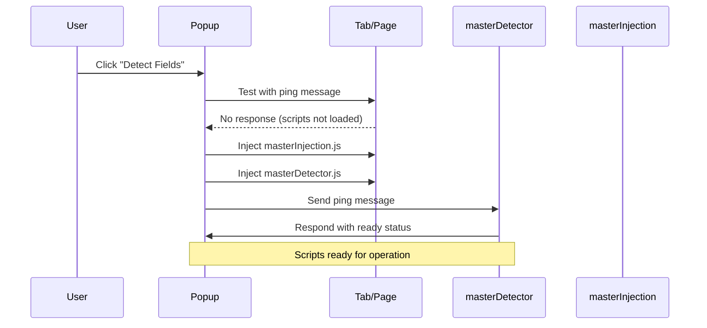

# Auto-Fill Extension - Master Architecture Documentation

## Table of Contents

1. [Current Architecture Overview](#current-architecture-overview)
2. [Master Detector System](#master-detector-system)
3. [Core Files &amp; Functions](#core-files--functions)
4. [Manual Injection Architecture](#manual-injection-architecture)
5. [Field Detection &amp; Form Filling Process](#field-detection--form-filling-process)
6. [Data Flow Diagrams](#data-flow-diagrams)
7. [Storage &amp; Security](#storage--security)
8. [File Dependencies](#file-dependencies)

---

## Current Architecture Overview

The Auto-Fill Extension follows a **Manifest V3** Chrome extension architecture with **Manual Content Script Injection** and **Master Detector System**:

```
┌─────────────────────────────────────────────────────────────────┐
│                     MANIFEST V3 ARCHITECTURE                    │
│                    (No Automatic Content Scripts)               │
└─────────────────────────────────────────────────────────────────┘
         │
         ▼
┌─────────────────┐    ┌─────────────────┐    ┌─────────────────┐
│   POPUP UI      │    │ INJECTED SCRIPTS│    │  BACKGROUND     │
│                 │    │                 │    │                 │
│ • Manual Control│◄──►│ • masterDetector│◄──►│ • Service Worker│
│ • Profile Mgmt  │    │ • masterInjection│   │ • Coordination  │
│ • Script Inject │    │ • Advanced AI   │    │ • Permissions   │
│ • Status Display│    │ • Portal Config │    │ • Lifecycle     │
└─────────────────┘    └─────────────────┘    └─────────────────┘
         │                       │                       │
         └───────────────────────┼───────────────────────┘
                                 │
                    ┌─────────────────┐
                    │ STORAGE & UTILS │
                    │                 │
                    │ • AES Encrypted │
                    │ • Profile Data  │
                    └─────────────────┘
```

## Master Detector System

The current implementation uses a **unified Master Detector architecture** that combines all previous detector capabilities:

### **Master Components**

1. **`masterDetector.js`** - Unified field detection with AI-like algorithms
2. **`masterInjection.js`** - Dedicated form filling engine
3. **Manual Injection** - Popup-controlled script loading (no automatic injection)

---

## Core Files & Functions

### 1. **Manifest & Configuration**

#### `manifest.json` - Extension Definition

```json
{
  "manifest_version": 3,
  "content_scripts": [{
    "matches": ["https://www.linkedin.com/*", "https://www.indeed.com/*"],
    "js": ["content/quickDetector.js"],
    "run_at": "document_idle"
  }]
}
```

**Purpose**: Defines extension permissions, content script injection, and resource access.

---

### 2. **Master Content Scripts** (Manually Injected)

#### `content/masterDetector.js` - **UNIFIED MASTER DETECTOR** ⭐ (1,070+ lines)

**Role**: Self-contained master field detection system combining all detection algorithms
**Key Features**:

```javascript
// IMMEDIATE ping response setup (fixes "Content script not loaded" error)
chrome.runtime.onMessage.addListener((request, sender, sendResponse) => {
  if (request.action === 'ping' || request.type === 'ping') {
    sendResponse({ 
      success: true, 
      status: 'ready', 
      initialized: isInitialized,
      detectorType: 'master',
      version: '1.0.0'
    });
    return true;
  }
});

// Advanced field detection with 6 algorithms
async function detectFieldAdvanced(element) {
  const results = await Promise.all([
    directAttributeMatching(element),      // Exact keyword matches
    fuzzyKeywordMatching(element),         // Similarity-based matching
    contextualAnalysis(element),           // Label and context analysis
    semanticAnalysis(element),             // Meaning-based detection
    portalSpecificMatching(element),       // Site-specific selectors
    learningBasedDetection(element)        // AI learning patterns
  ]);
  return combineDetectionResults(element, results);
}
```

**Advanced Capabilities**:

- **25+ Field Types**: firstName, lastName, email, phone, linkedinUrl, etc.
- **Fuzzy Matching**: Levenshtein distance algorithm for similarity scoring
- **Confidence Scoring**: Weighted confidence calculation (0-1 scale)
- **Portal Intelligence**: LinkedIn, Indeed, Glassdoor specific optimizations
- **Learning System**: Stores successful detection patterns
- **Self-Contained**: No external dependencies (1,070+ lines of unified code)

#### `content/masterInjection.js` - **DEDICATED FORM FILLING ENGINE** ⭐ (524+ lines)

**Role**: Specialized form filling engine extracted from masterDetector for separation of concerns
**Key Features**:

```javascript
// Main form filling orchestrator
function fillFormWithProfileData(profileData, detectedFields = null) {
  // Intelligent field processing with confidence thresholds
  // Framework-compatible event triggering (React, Vue, Angular)
  // Advanced field mapping and validation
  return {
    filledCount,
    fillResults,
    totalFields,
    fillErrors,
    success: filledCount > 0
  };
}

// Smart field mapping with nested profile support
function getValueForField(category, profileData) {
  // Supports both flat and nested profile structures
  // Maps 25+ field categories to profile data
  // Handles complex mappings like fullName composition
}

// Advanced form field filling with framework compatibility
function fillFormField(element, value) {
  // Handles input, select, textarea, checkbox, radio types
  // Triggers events for React/Vue/Angular compatibility
  // Validates and reports filling success/failure
}
```

**Separation of Concerns Architecture**:

- **masterDetector.js**: Pure field detection and coordination
- **masterInjection.js**: Pure form filling and DOM manipulation
- **Communication**: masterDetector delegates filling to masterInjection
- **Independence**: Each can operate independently for testing

---

### 3. **Popup Interface** (Extension UI - Manual Control System)

#### `popup/popup.js` - **MASTER UI CONTROLLER & INJECTION MANAGER** ⭐ (550+ lines)

**Role**: Manages popup interface and orchestrates manual script injection
**Key Functions**:

```javascript
// Enhanced field detection workflow with manual injection
async function handleDetectFields() {
  try {
    updateStatusDisplay('working', 'Detecting...');
    const [tab] = await chrome.tabs.query({ active: true, currentWindow: true });
  
    // Manual script injection with comprehensive error handling
    await ensureContentScriptInjected(tab.id);
  
    // Send detection request to masterDetector
    const response = await chrome.tabs.sendMessage(tab.id, {
      action: 'detectFields'
    });
  
    displayDetectionResults(response);
    updateStatusDisplay('active', 'Fields detected');
  } catch (error) {
    handleDetectionError(error);
  }
}

// Advanced form filling workflow with profile encryption support
async function handleFillForm() {
  // 1. Load and decrypt user profile data
  let profileData = null;
  if (storageManager) {
    profileData = await storageManager.getUserProfile(); // Encrypted storage
  } else {
    const result = await chrome.storage.local.get('userProfile'); // Fallback
    profileData = result.userProfile;
  }
  
  // 2. Ensure both master scripts are injected
  await ensureContentScriptInjected(tab.id);
  
  // 3. Force field detection before filling
  const detectionResponse = await chrome.tabs.sendMessage(tab.id, {
    action: 'detectFields'
  });
  
  // 4. Send fill request to masterDetector (delegates to masterInjection)
  const response = await chrome.tabs.sendMessage(tab.id, {
    action: 'fillForm',
    profileData: profileData
  });
}

// Advanced manual injection system with retry logic
async function ensureContentScriptInjected(tabId) {
  console.log('=== Starting Content Script Injection Process ===');
  
  try {
    // Test existing content script with ping
    const response = await chrome.tabs.sendMessage(tabId, { action: 'ping' });
    if (response && response.success) {
      console.log('Content script already loaded and responding');
      return;
    }
  } catch (pingError) {
    console.log('Content script not loaded, will inject');
  }

  // Inject masterInjection.js first (optional dependency)
  try {
    await chrome.scripting.executeScript({
      target: { tabId },
      files: ['content/masterInjection.js']
    });
    console.log('✅ masterInjection.js injected successfully');
  } catch (error) {
    console.warn('⚠️ Failed to inject masterInjection.js (will use fallback)');
  }

  // Inject masterDetector.js (required) 
  await chrome.scripting.executeScript({
    target: { tabId },
    files: ['content/masterDetector.js']
  });
  console.log('✅ masterDetector.js injected successfully');
  
  // Verify injection worked
  await new Promise(resolve => setTimeout(resolve, 2000));
  const verifyResponse = await chrome.tabs.sendMessage(tabId, { action: 'ping' });
  if (!verifyResponse || !verifyResponse.success) {
    throw new Error('Content script failed to initialize');
  }
}
```

**Manual Injection Benefits**:

- **Complete Control**: Scripts only loaded when user requests action
- **Reliability**: No timing issues with automatic injection
- **Error Handling**: Comprehensive retry and fallback mechanisms
- **Performance**: Scripts loaded on-demand, not on every page
- **Debugging**: Clear injection status and error reporting

#### `popup/popup.html` - **UI STRUCTURE**

**Role**: Defines popup interface structure
**Key Elements**:

```html
<button id="detectFieldsBtn">🔍 Detect Fields</button>
<button id="fillFormBtn">⚡ Fill Form</button>
<div id="detectionResults"><!-- Field detection results --></div>
<div id="profileStatus"><!-- Profile configuration status --></div>
```

#### `popup/popup.css` - **UI STYLING**

**Role**: Dark theme styling with yellow accent colors

---

### 4. **Storage & Data Management**

#### `utils/storage.js` - **SECURE DATA STORAGE** ⭐

**Role**: Handles encrypted storage of sensitive user profile data
**Key Functions**:

```javascript
class StorageManager {
  // AES-256 encryption for sensitive data
  async encryptData(data) {
    // Encrypts profile data before Chrome storage
  }
  
  // Profile management
  async saveProfile(profileData) {
    const encrypted = await this.encryptData(profileData);
    await chrome.storage.local.set({ userProfile: encrypted });
  }
  
  async getProfile() {
    const stored = await chrome.storage.local.get('userProfile');
    return await this.decryptData(stored.userProfile);
  }
}
```

#### `utils/encryption.js` - **ENCRYPTION UTILITIES**

**Role**: Provides AES-256 encryption/decryption functions for sensitive data

---

### 5. **Options/Settings Page**

#### `options/options.js` - **PROFILE CONFIGURATION** ⭐

**Role**: Manages user profile setup and extension settings
**Key Features**:

```javascript
// Profile form management
async function saveProfile() {
  const profileData = {
    firstName: elements.firstName.value,
    lastName: elements.lastName.value,
    email: elements.email.value,
    phone: elements.phoneNumber.value,
    linkedinUrl: elements.linkedinUrl.value,
    githubUrl: elements.githubUrl.value,
    // ... other profile fields
  };
  
  await storageManager.saveProfile(profileData);
}

// Settings management
async function saveSettings() {
  // Portal configurations, security settings
}
```

#### `options/options.html` - **SETTINGS UI**

**Role**: User interface for profile setup and extension configuration

#### `options/options.css` - **SETTINGS STYLING**

**Role**: Consistent styling for settings interface

---

### 6. **Background Services**

#### `background/serviceWorker.js` - **BACKGROUND COORDINATOR**

**Role**: Handles extension lifecycle and cross-tab communication
**Functions**:

- Extension installation/update handling
- Cross-tab message coordination
- Permission management

---

### 7. **Utility Files**

#### `utils/advancedDetector.js` - **FIELD DETECTION ALGORITHMS**

**Role**: Advanced field detection logic with ML-like scoring
**Key Features**:

- Fuzzy field matching
- Confidence scoring
- Portal-specific optimizations

#### `utils/autoFillEngine.js` - **FORM FILLING ENGINE**

**Role**: Intelligent form filling with field mapping
**Key Features**:

- Smart field value assignment
- Form validation handling
- Visual feedback for filled fields

#### `utils/performance.js` - **PERFORMANCE MONITORING**

**Role**: Tracks extension performance metrics
**Key Features**:

- Field detection timing
- Form filling success rates
- Error tracking

---

### 8. **Debug & Testing**

#### `debug/test-content-script.js` - **TESTING INFRASTRUCTURE**

**Role**: Simple content script for testing injection mechanisms

#### `debug/test-popup.js` - **UI TESTING TOOLS**

**Role**: Adds test buttons to popup for debugging content script loading

#### `debug/debug-console.js` - **DEBUG UTILITIES**

**Role**: Enhanced logging and debugging tools

---

## Manual Injection Architecture

### **No Automatic Content Scripts**

Unlike traditional extensions, this implementation uses **manual injection** for better control:

```json
// manifest.json - NO content_scripts section
{
  "manifest_version": 3,
  "permissions": ["storage", "activeTab", "scripting"],
  "web_accessible_resources": [{
    "resources": [
      "content/masterInjection.js",
      "content/masterDetector.js"
    ],
    "matches": ["<all_urls>"]
  }]
}
```

### **User-Initiated Workflow**

1. **User clicks "Detect Fields"** → Popup injects scripts
2. **User clicks "Fill Form"** → Popup injects scripts (if needed) + sends data
3. **Scripts remain loaded** for the session
4. **Clean state** on page navigation

---

## Field Detection & Form Filling Process

### **Phase 1: Manual Script Injection**



### **Phase 2: Advanced Field Detection Algorithm (6-Method System)**

```javascript
// Master detection with 6 parallel algorithms
async function detectFieldAdvanced(element) {
  const results = await Promise.all([
    directAttributeMatching(element),    // 95% confidence - exact matches
    fuzzyKeywordMatching(element),       // 80% confidence - similarity based
    contextualAnalysis(element),         // 75% confidence - label context
    semanticAnalysis(element),           // 85% confidence - meaning analysis
    portalSpecificMatching(element),     // 98% confidence - site-specific
    learningBasedDetection(element)      // 95% confidence - AI learning
  ]);
  
  return combineDetectionResults(element, results);
}

// Weighted confidence scoring
function combineDetectionResults(element, resultSets) {
  const methodWeights = {
    'portal-specific': 1.0,    // Highest priority
    'direct': 0.9,
    'semantic': 0.8,
    'contextual': 0.7,
    'learning': 0.85,
    'fuzzy': 0.6
  };
  
  // Calculate weighted confidence scores
  // Return best match above threshold (0.5)
}
```

### **Phase 3: Comprehensive Portal Intelligence**

```javascript
// Advanced portal configurations with multiple selector strategies
const PORTAL_CONFIGS = {
  linkedin: {
    name: 'LinkedIn',
    priority: 10,
    specificSelectors: {
      firstName: [
        '#single-line-text-form-component-firstName', 
        'input[name*="firstName"]'
      ],
      lastName: [
        '#single-line-text-form-component-lastName', 
        'input[name*="lastName"]'
      ]
    },
    excludePatterns: ['hidden', 'csrf', 'token'],
    dynamicContent: true
  },
  indeed: {
    name: 'Indeed', 
    priority: 9,
    specificSelectors: {
      firstName: ['input[name="applicant.name"]'],
      email: ['input[name="applicant.email"]']
    },
    excludePatterns: ['recaptcha', 'hidden']
  }
};
```

### **Phase 4: Master Form Filling Process**

```javascript
// Separation of concerns: Detection → Delegation → Filling
// 1. masterDetector receives fillForm message
case 'fillForm':
  const profileData = request.profileData || {};
  
  // 2. Delegate to masterInjection
  if (window.masterInjection && window.masterInjection.fillFormWithProfileData) {
    const fillResult = window.masterInjection.fillFormWithProfileData(
      profileData, 
      detectedFields
    );
  
    // 3. Return comprehensive results
    sendResponse({
      success: fillResult.success,
      filledFields: fillResult.filledCount,
      totalFields: fillResult.totalFields,
      fillResults: fillResult.fillResults,
      fillErrors: fillResult.fillErrors,
      detectorType: 'master',
      injectionEngine: 'masterInjection'
    });
  }
```

## Advanced Form Filling Engine (masterInjection.js)

### **Intelligent Profile Data Mapping**

```javascript
// Nested profile data extraction with fallback chains
function getValueForField(profileData, fieldType) {
  const mappingPaths = {
    firstName: [
      'personalInfo.name.first',
      'personalInfo.firstName', 
      'name.first',
      'firstName'
    ],
    lastName: [
      'personalInfo.name.last',
      'personalInfo.lastName',
      'name.last', 
      'lastName'
    ],
    email: [
      'personalInfo.contact.email',
      'contact.email',
      'personalInfo.email',
      'email'
    ],
    phone: [
      'personalInfo.contact.phone',
      'contact.phone', 
      'personalInfo.phone',
      'phone'
    ]
  };

  const paths = mappingPaths[fieldType] || [fieldType];
  
  for (const path of paths) {
    const value = getNestedObjectValue(profileData, path);
    if (value && value.toString().trim()) {
      return value.toString().trim();
    }
  }
  return null;
}

// Deep object traversal utility
function getNestedObjectValue(obj, path) {
  return path.split('.').reduce((current, key) => 
    current && current[key] !== undefined ? current[key] : null, obj
  );
}
```

### **Framework-Agnostic Field Filling**

```javascript
// React, Vue, Angular, vanilla JS compatibility
function fillFormField(element, value, fieldInfo) {
  const originalValue = element.value;
  
  try {
    // Handle different input types
    if (element.type === 'checkbox' || element.type === 'radio') {
      element.checked = ['true', '1', 'yes', 'on'].includes(
        value.toString().toLowerCase()
      );
    } else if (element.tagName === 'SELECT') {
      selectBestOption(element, value);
    } else {
      // Text inputs
      element.value = value;
    }
  
    // Comprehensive event triggering for framework detection
    const events = [
      'input', 'change', 'blur', 'focus',
      'keydown', 'keyup', 'keypress'
    ];
  
    events.forEach(eventType => {
      const event = new Event(eventType, { 
        bubbles: true, 
        cancelable: true 
      });
      element.dispatchEvent(event);
    });
  
    // React-specific property setter bypass
    if (window.React || element._reactInternalFiber) {
      const nativeInputValueSetter = Object.getOwnPropertyDescriptor(
        window.HTMLInputElement.prototype, "value"
      ).set;
      nativeInputValueSetter.call(element, value);
    
      element.dispatchEvent(new Event('input', { bubbles: true }));
    }
  
    return true;
  
  } catch (error) {
    console.error('Field filling error:', error);
    return false;
  }
}

// Intelligent dropdown selection
function selectBestOption(selectElement, targetValue) {
  const options = Array.from(selectElement.options);
  const normalizedTarget = targetValue.toString().toLowerCase().trim();
  
  // Try exact matches first
  let bestOption = options.find(opt => 
    opt.text.toLowerCase().trim() === normalizedTarget ||
    opt.value.toLowerCase().trim() === normalizedTarget
  );
  
  // Fallback to partial matches
  if (!bestOption) {
    bestOption = options.find(opt =>
      opt.text.toLowerCase().includes(normalizedTarget) ||
      normalizedTarget.includes(opt.text.toLowerCase().trim())
    );
  }
  
  if (bestOption) {
    selectElement.selectedIndex = bestOption.index;
    return true;
  }
  return false;
}
```

### **Comprehensive Success Validation & Reporting**

```javascript
// Master orchestration function in masterInjection.js
function fillFormWithProfileData(profileData, detectedFields = []) {
  const results = {
    success: false,
    filledCount: 0,
    totalFields: detectedFields.length,
    fillResults: [],
    fillErrors: [],
    timestamp: new Date().toISOString()
  };
  
  detectedFields.forEach((fieldInfo, index) => {
    try {
      const value = getValueForField(profileData, fieldInfo.category);
    
      if (value) {
        const fillSuccess = fillFormField(
          fieldInfo.element, 
          value, 
          fieldInfo
        );
      
        if (fillSuccess) {
          results.filledCount++;
          results.fillResults.push({
            category: fieldInfo.category,
            value: value,
            confidence: fieldInfo.confidence,
            method: fieldInfo.detectionMethod || 'unknown',
            filled: true
          });
        } else {
          results.fillErrors.push({
            category: fieldInfo.category,
            error: 'Failed to set field value',
            element: fieldInfo.element.tagName
          });
        }
      } else {
        results.fillResults.push({
          category: fieldInfo.category,
          filled: false,
          reason: 'No matching profile data'
        });
      }
    
    } catch (error) {
      results.fillErrors.push({
        category: fieldInfo.category || 'unknown',
        error: error.message,
        index: index
      });
    }
  });
  
  // Success condition: at least one field filled successfully
  results.success = results.filledCount > 0;
  
  return results;
}
```

---

## Updated Data Flow Diagrams

### **Master Detection Flow**

```
User clicks "Detect Fields"
         │
         ▼
┌─────────────────┐
│ popup.js        │
│ ensureContentScriptInjected() │
└─────────┬───────┘
          │
          ▼
┌─────────────────┐
│ Inject masterDetector.js │
│ & masterInjection.js    │
└─────────┬───────┘
          │
          ▼
┌─────────────────┐
│ masterDetector.js │
│ detectFormFields() │
│ (6 algorithms)     │
└─────────┬───────┘
          │
          ▼
┌─────────────────┐
│ Return Enhanced │
│ Field Analysis  │
└─────────┬───────┘
          │
          ▼
┌─────────────────┐
│ popup.js        │
│ displayFieldResults() │
└─────────────────┘
```

### **Master Form Filling Flow**

```
User clicks "Fill Form"
         │
         ▼
┌─────────────────┐
│ popup.js        │
│ handleFillForm() │
└─────────┬───────┘
          │
          ▼
┌─────────────────┐
│ StorageManager  │
│ getDecryptedProfile() │
└─────────┬───────┘
          │
          ▼
┌─────────────────┐
│ masterDetector.js │
│ delegates to     │
│ masterInjection  │
└─────────┬───────┘
          │
          ▼
┌─────────────────┐
│ masterInjection.js │
│ fillFormWithProfileData() │
└─────────┬───────┘
          │
          ▼
┌─────────────────┐
│ Enhanced DOM Updates │
│ Framework Events    │
│ Success Validation  │
└─────────────────┘
```

---

## Storage & Security

### **Data Encryption Flow**

```javascript
// 1. User Profile Input (options.js)
const profileData = {
  firstName: "John",
  lastName: "Doe",
  email: "john@example.com",
  linkedinUrl: "linkedin.com/in/johndoe"
};

// 2. Encryption (storage.js)
const encrypted = await storageManager.encryptData(profileData);

// 3. Chrome Storage
await chrome.storage.local.set({ userProfile: encrypted });

// 4. Retrieval & Decryption
const stored = await chrome.storage.local.get('userProfile');
const decrypted = await storageManager.decryptData(stored.userProfile);

// 5. Form Filling (quickDetector.js)
element.value = decrypted.firstName;
```

### **Security Features**

- **AES-256 Encryption**: All personal data encrypted before storage
- **Local-Only Storage**: No external data transmission
- **Memory Protection**: Encryption keys not persisted
- **Permission Minimization**: Only required Chrome permissions

---

## File Dependencies

### **Active Files (Current Implementation)**

```
manifest.json
├── content/quickDetector.js          (Primary content script)
├── popup/
│   ├── popup.html                    (UI structure)
│   ├── popup.css                     (UI styling)
│   ├── popup.js                      (Main logic)
│   ├── enhanced-injection.js         (Robust injection)
│   └── enhanced-override.js          (UI enhancements)
├── utils/storage.js                  (Encrypted storage)
├── options/
│   ├── options.html                  (Settings UI)
│   ├── options.css                   (Settings styling)
│   └── options.js                    (Profile management)
└── background/serviceWorker.js       (Background processes)
```

### **Legacy Files (For Reference)**

```
content/
├── detector.js                       (Original detector)
├── enhancedDetector.js              (Complex detector)
utils/
├── advancedDetector.js              (ML algorithms)
├── autoFillEngine.js                (Advanced filling)
├── performance.js                   (Metrics)
└── encryption.js                    (Crypto utilities)
```

### **Debug & Testing**

```
debug/
├── test-content-script.js           (Injection testing)
├── test-popup.js                    (UI testing)
└── debug-console.js                 (Debug tools)
test/
└── job-portal-test.html             (Local testing page)
```

---

## Key Algorithms

### **1. Field Type Identification**

```javascript
function identifyFieldType(attributes) {
  const combined = `${attributes.name} ${attributes.id} ${attributes.placeholder}`.toLowerCase();
  
  if (combined.includes('firstname') || combined.includes('first_name')) {
    return 'firstName';
  }
  if (combined.includes('linkedin')) {
    return 'linkedinUrl';
  }
  if (combined.includes('email')) {
    return 'email';
  }
  // ... more patterns
}
```

### **2. Smart Form Filling**

```javascript
function fillFormFields(profileData) {
  detectedFields.forEach(field => {
    const value = getValueForField(field.category, profileData);
    if (value && field.element) {
      field.element.value = value;
      field.element.dispatchEvent(new Event('input', { bubbles: true }));
    }
  });
}
```

### **3. Portal Detection**

```javascript
function identifyJobPortal() {
  const hostname = window.location.hostname.toLowerCase();
  
  if (hostname.includes('linkedin.com')) {
    return PORTAL_CONFIGS.linkedin;
  }
  if (hostname.includes('indeed.com')) {
    return PORTAL_CONFIGS.indeed;
  }
  return null; // Generic handling
}
```

---

## Performance Optimizations

1. **Immediate Ping Response**: Content scripts respond to ping before heavy initialization
2. **Retry Logic**: Multiple injection attempts with exponential backoff
3. **DOM Caching**: Cache frequently accessed DOM elements
4. **Debounced Detection**: Avoid excessive field detection on dynamic pages
5. **Selective Injection**: Only inject scripts when needed

---

## Troubleshooting Common Issues

### **"Content script not loaded" Error**

- **Cause**: Timing issues between popup and content script initialization
- **Solution**: `enhanced-injection.js` with retry logic and proper timeouts

### **Field Detection Failures**

- **Cause**: Portal-specific field structures not recognized
- **Solution**: Add portal configurations in `quickDetector.js`

### **Form Filling Not Working**

- **Cause**: Missing profile data or incorrect field mapping
- **Solution**: Verify profile setup in options page and field detection accuracy

---

This documentation provides a complete understanding of how the Auto-Fill Extension detects form fields and fills them with user data, from the initial content script injection to the final form submission.
